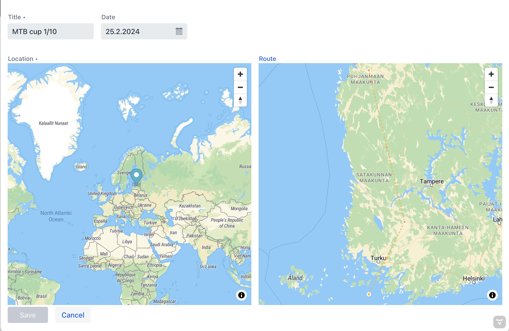

# Interactive Spatial WebApp



**Interactive Spring Boot web application for managing spatial data in a relational database.**

## Features

- **Backend:** Built with [Spring Boot](https://spring.io/projects/spring-boot) and [Spring Data JPA](https://spring.io/projects/spring-data) for efficient data management.
- **Spatial Support:** Uses [Hibernate Spatial](http://hibernate.org/orm/) to handle geographical data types and spatial queries.
- **Database:** Supports PostGIS (PostgreSQL + spatial extensions), H2GIS, or MySQL. Docker + TestContainers integration available for PostGIS demo.
- **Frontend:** Interactive map UI using [Vaadin](https://vaadin.com/) with [MapLibreGL](https://vaadin.com/directory/component/maplibregl--add-on) for editing geographic features directly.
- **Base Map:** Vector maps via [OpenStreetMap](https://www.openstreetmap.org/) and [MapTiler](https://www.maptiler.com) (or any standard map layer).
- **Efficient Queries:** Optimized database structure allows fast queries and dynamic viewport-based data loading.

## What It Does

This application lets you **view, edit, and manage geographic data** on a map in real time. You can handle points, lines, and polygons with backend persistence in the database.  

**Use Cases:**
- GIS data management  
- Map-based dashboards  
- Spatial data visualization  

## Getting Started

1. Clone the repository:  
```bash
   git clone https://github.com/<your-username>/interactive-spatial-webapp.git
   cd interactive-spatial-webapp
```
2. Ensure you have Java 17, Maven, and Docker installed.
3. Run the application:
```bash
mvn spring-boot:run
```

Open your browser at `http://localhost:8080`

---

# Tech Stack

Backend: Java, Spring Boot, Hibernate Spatial

Frontend: Vaadin, MapLibreGL

Database: PostgreSQL/PostGIS, H2GIS, MySQL

Dev Tools: Docker, TestContainers

---

Author: Ravi Kumar Chinta
GitHub: https://github.com/ravi-kumar-chinta

---
# Thank You

**Thank you for checking out this project!**
Feel free to explore, contribute, or provide feedback. 😊